    
<h3 ></h3>    

	
	

    <h3>Languages and tools</h3>
    &nbsp;&nbsp;
    &nbsp;&nbsp;
    &nbsp;&nbsp;  
    &nbsp;&nbsp;
    &nbsp;&nbsp;
    &nbsp;&nbsp;
    &nbsp;&nbsp;
    &nbsp;&nbsp;

	<h3 style = 'margin-top: 100px' align = 'center'>My stats</h3>
	
	
	
	

